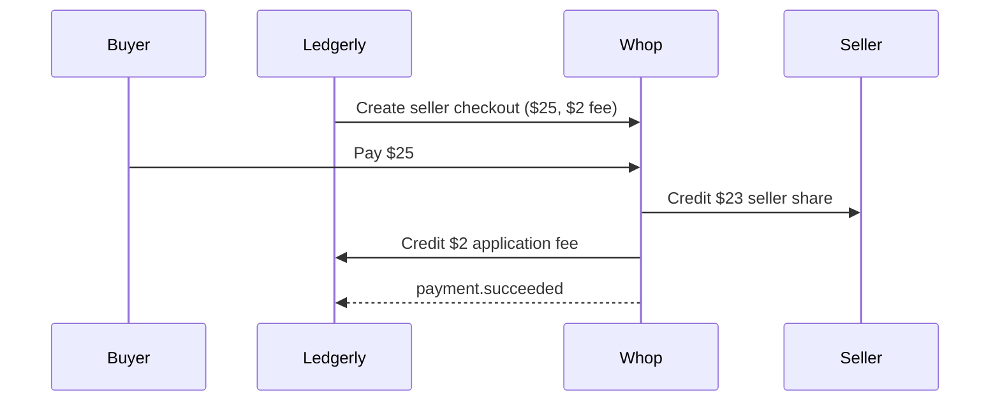
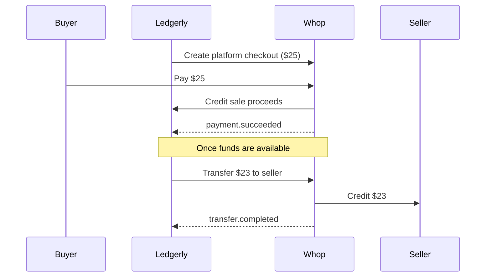

# Ledgerly

A Next.js and PostgreSQL starter for Whop: seller onboarding, 8% checkout fees, embedded payouts, signed webhooks, and reconciliation.

## What's included

| Area | Purpose |
| --- | --- |
| Onboarding | Create or find a connected account by seller ID and generate a fresh verification link. |
| Checkout | Create seller or platform checkouts with the 8% fee calculated and validated on the server. |
| Payouts | Show balances and activity, with embedded withdrawals and a Whop-hosted alternative. |
| Operations | Persist signed webhook events once and compare Whop transactions with the local ledger. |

## Quick start

Requires **Node.js 22.22+** and **PostgreSQL**. For a local database, run `docker compose up -d`.

```sh
npm ci
cp -n .env.example .env.local
chmod 600 .env.local
```

In `.env.local`, set the parent account's `WHOP_API_KEY` and `WHOP_PLATFORM_ACCOUNT_ID`, plus `DATABASE_URL` and `APP_URL`. See [.env.example](.env.example) for values. Review/apply the schema, then start:

```sh
npm run db:push
npm run dev
```

Open [localhost:3000](http://localhost:3000) to create a seller or manage payouts. Whop verification and the hosted portal require an HTTPS `APP_URL`.

This uses production Whop credentials. The app has no built-in authentication; restrict access before hosting.

## Seller flow

1. Choose **Create a new seller account** and enter seller ID → email → country. Reusing the same details finds the existing account.
2. Continue to Whop verification, then return to check the seller's status and outstanding requirements.
3. Choose **Manage your payouts** to select a seller and view balances, activity, and withdrawal options.

Embedded payouts use a scoped, ten-minute access token. **Open Whop portal** creates a temporary hosted link for the same seller.

## Money flows

**$25 sale → $2 platform fee + $23 seller share**, before processing fees, reserves, and settlement delays.

### Direct charge



### Platform charge and transfer



Checkout creation returns a purchase URL. Payments, refunds, and transfers are separate operator actions.

## Webhooks

Next.js receives connected-seller events at `/api/webhooks/whop` and Ledgerly's own payment events at `/api/webhooks/whop/parent`. Each hook has a separate signing secret.

Verified receipts are stored in PostgreSQL and deduplicated by event ID across restarts. Events with unknown ownership are saved as `quarantined` for review. See [webhook setup and replay](docs/operations.md#webhooks).

## Tests and reconciliation

```sh
npm test         # Unit and component tests
npm run test:db  # Disposable database tests
npm run --silent reconcile -- seller-123 2026-10-01T00:00:00Z 2026-10-06T00:00:00Z
```

Tests use synthetic Whop responses. The reconciliation job fetches a registered seller's payments and transfers from Whop and compares them with the ledger derived from saved webhook receipts. It reports missing records, duplicates, and amount or status mismatches for review.

Use your seller ID and time window in the command above. The job returns JSON and exits with `0` for a match, `2` for differences, or `1` for failure. It does not change financial records.

See the [operations guide](docs/operations.md) for checkout code, webhook setup, payouts, and deployment. [Evidence notes](evidence/README.md) cover verification and submission records.
