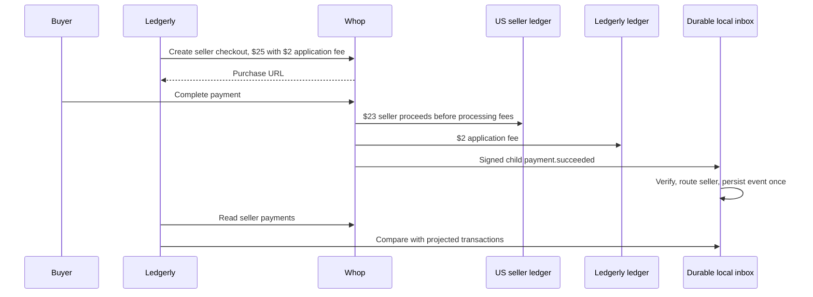
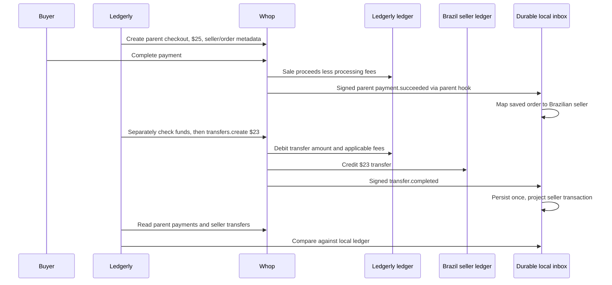

# Ledgerly

A small Whop platform integration: seller onboarding, an 8% checkout fee, a durable webhook inbox, seller reconciliation, and a password-protected payouts page. The backend uses TypeScript functions and one CLI, with Upstash Redis for Vercel hosting or private JSON files for local development. No SQL migrations or queue service are required.

## Try it without credentials

Use Node.js 22.22 or newer (the version used for local verification).

```sh
npm ci
npm run ledgerly -- demo
npm test
```

The demo uses an in-memory Whop fixture provider with no network transport. It creates US and Brazil fixture sellers, repeats onboarding, creates both checkout flows, verifies signed events and a duplicate, and runs both a clean reconciliation and an intentional $1 mismatch. It writes an isolated `.data/demo-*` directory and a labeled report under `evidence/integration/`. It never calls Whop or uses your API key.

## Configure a real integration

```sh
npm run setup
```

Setup creates `.env.local` and `local-access.txt` with random local login credentials. Both are ignored by Git and Vercel. Existing files are preserved; add any missing variables from [.env.example](.env.example) yourself. Keep seller input files under `.data/` so their emails stay private.

| Variable | Purpose |
| --- | --- |
| `WHOP_API_KEY` | Parent account API key; server/operator process only |
| `WHOP_PLATFORM_ACCOUNT_ID` | Parent `biz_` ID, checked against `/accounts/me`; required for onboarding |
| `WHOP_ENVIRONMENT` | `production` by default; `sandbox` uses a separate API origin |
| `LEDGERLY_DATA_DIR` | Private directory for local file storage; defaults to `.data/ledgerly` |
| `UPSTASH_REDIS_REST_URL`, `UPSTASH_REDIS_REST_TOKEN` | Shared persistent store; required on Vercel. The integration's `KV_REST_API_URL` / `KV_REST_API_TOKEN` names are also accepted |
| `LEDGERLY_STORAGE_NAMESPACE` | Defaults to `ledgerly-v1`; use the same value in the hosted app and CLI, and a different value for preview deployments |
| `WHOP_WEBHOOK_SECRET` | Whop-issued `ws_` secret for live deliveries |
| `WHOP_PARENT_WEBHOOK_SECRET` | Separate Whop-issued secret for Ledgerly's own payment hook |
| `WHOP_ACCOUNT_ID` | Optional existing seller for `/payouts` without a selection; registered sellers use their own account |
| `APP_URL` | App origin: localhost for development, exact HTTPS origin when hosted |
| `ASSESSMENT_PASSWORD` | Payouts demo login password, at least 20 characters |
| `SESSION_SECRET` | Separate signing secret, at least 32 characters |

The assessment uses production following Whop's clarification. CLI commands that call Whop require `--live`; `demo` is always offline. Use a separate data directory and credentials for each environment. Never prefix these variables with `NEXT_PUBLIC_`. The payouts page itself uses production.

### Onboard a seller in the app

Run `npm run dev`, sign in, and open [the seller page](http://localhost:3000/sellers). The password is in `local-access.txt`.

1. Enter the seller's stable Ledgerly ID, email, and country, then **Create or find seller**. This calls the same idempotent backend used by the CLI and opens that seller's account page.
2. Choose **Continue on Whop** to get a fresh hosted verification link. The server controls both callback URLs. Creating/finding accounts works locally, but verification links require an HTTPS `APP_URL`; that button explains the requirement on localhost.
3. After Whop returns to `/sellers/{externalId}?returned=1`, the page reads current verification, required actions, and payment/payout capabilities from Whop. Returning is not treated as proof of approval. An expired link returns with `?refresh=1`, where Continue on Whop creates another link.
4. **Open seller payouts** follows that same registered seller. The token, portal, fee reads, and fee changes all resolve the external ID server-side and verify its current parent and status. Unknown, mismatched, and suspended sellers cannot obtain payout access through this flow.

The password authenticates an assessment **operator** who may manage every seller in this local registry, plus the optional configured payout account. It is not a separate login for each seller. Before using this as a public marketplace, replace the shared password with real identities and per-seller authorization. Login preserves allowed workspace return paths when a session expires during verification.

The new routes are `POST /api/sellers`, `GET /api/sellers/{externalId}`, and `POST /api/sellers/{externalId}/onboarding`. They require the operator session; mutations also require the configured origin. No API key, identity document, or raw account response is sent to the browser. Seller records and emails stay in the private registry.

### Onboard a seller from the CLI

Save `.data/seller.json`, substituting the seller's actual identity:

```json
{ "externalId": "seller-123", "email": "seller@example.com", "country": "US" }
```

```sh
npm run ledgerly -- onboard --input .data/seller.json \
  --return-url https://your-app.example/onboarding/return \
  --refresh-url https://your-app.example/onboarding/refresh --live
```

The output contains the account ID and a fresh onboarding URL. Open that URL to complete verification. Replace both callbacks with HTTPS pages you control, or use the app's `/sellers/{externalId}?returned=1` and `?refresh=1` pages with the same configured store and registry.

`externalId` identifies the seller; email alone does not. The function stores `metadata.external_id`, verifies the returned parent/email/country, and keeps an immutable seller binding. Repeating it returns the same account and a new link. The searchable selector and backend share the 249 ISO 3166-1 country/territory codes; the API and CLI normalize lowercase input to uppercase. Country options describe business locations, not guaranteed account or payout eligibility: Whop makes that decision during account setup. US, DE, and BR remain assessment examples. Changing identity fields under an existing external ID is rejected.

The current accounts contract infers the parent from the Account API key. The legacy assessment's `parent_company_id` is therefore not sent to `/accounts`; `/accounts/me` is checked against the configured parent before creating anything. [Account contract](https://docs.whop.com/api-reference/beta/accounts/create-account).

### Create a checkout

Save `.data/order.json`:

```json
{
  "orderId": "order-123",
  "sellerExternalId": "seller-123",
  "title": "Acme Preset Pack",
  "amount": "25.00",
  "currency": "usd",
  "flow": "direct",
  "redirectUrl": "https://your-app.example/orders/thanks"
}
```

```sh
npm run ledgerly -- checkout --input .data/order.json --live
```

The function computes the fee itself: **$25.00 → $2.00 fee and $23.00 seller allocation before processing fees**. USD amounts use integer cents; 8% rounds to the nearest cent, half up. Prices must be positive, at most $1,000,000, and produce a nonzero fee below the price. No caller-provided fee is trusted. Other currencies and fractional cents are rejected.

For a platform sale, use a new `orderId` and `"flow": "platform"`. Its checkout charges the parent and omits `application_fee_amount`. The $23 share is an expected allocation; an operator submits the transfer separately after the sale and available-funds check. The CLI does not charge a card, refund, or automatically transfer funds.

An order ID always identifies the same seller, flow, price, title, and return URL. Repeats reuse the checkout; changed inputs require a new order ID. Both flows include order and seller metadata so platform-owned payments can be attributed later.

### Retry behavior

Before an account or checkout POST, its input, idempotency key, API version, credential fingerprint, and start time are saved atomically. Retries first search for the existing remote resource by metadata, recovering a successful create even if its response or the following local write was lost.

Whop caches authenticated POST outcomes for 24 hours, including 4xx errors. Retries use the original key and inputs. If no resource can be recovered, this implementation stops after 23 hours or a credential change rather than risk another create. Concurrent `409` responses can be retried with the same operation ID. Review cached validation failures manually; do not delete the journal or rotate keys to bypass an unknown outcome. [Idempotency contract](https://docs.whop.com/developer/api/idempotency).

### Contracts and permissions

| Operation | Pin and required actions |
| --- | --- |
| Account create/list | `2026-09-29`; `company:create_child`, `payout:account:read` |
| Inline checkout create | `2025-01-01`; `checkout_configuration:create`, `plan:create`, `access_pass:create`, `access_pass:update`, `checkout_configuration:basic:read` |
| Checkout recovery reads | `2026-09-29`; `checkout_configuration:basic:read` |
| Reconciliation reads | `2026-09-29`; `payment:basic:read`, `payout:transfer:read` |
| Register/manage webhooks | `developer:manage_webhook`; registration remains an operator step |

Use the parent credential with access to its direct children. Inline checkout uses the legacy contract because it documents `plan.product` and `application_fee_amount`; the current SDK 2.2.0 input does not expose that shape. Its charging owner is `plan.company_id`. This version boundary is explicit in `provider.ts`. The new CLI has only been exercised against fixtures; confirm real responses before relying on it in production. Checkout responses may omit the fee, so validating the request does not prove fee settlement. [Checkout schema](https://docs.whop.com/api-reference/checkout-configurations/create-checkout-configuration), [account listing](https://docs.whop.com/api-reference/beta/accounts/list-accounts), [payments](https://docs.whop.com/api-reference/beta/payments/list-payments), [transfers](https://docs.whop.com/api-reference/beta/transfers/list-transfers).

## Webhooks and the local ledger

`POST /api/webhooks/whop` verifies the raw body using Whop's Standard Webhooks contract: HMAC-SHA256, constant-time comparison, a five-minute timestamp tolerance, and matching signed-header/body event IDs. It atomically saves one sanitized receipt per event ID. Deduplication survives concurrent deliveries and restarts; changed content under the same ID returns 409. Storage failures are not acknowledged. [Signature and delivery contract](https://docs.whop.com/developer/guides/webhooks).

Routing uses the persisted registry. Direct payments use their account; platform payments use the saved order/checkout; transfers use their source and destination. Unknown or conflicting identities are quarantined. All eight requested event types are retained, but only payments and completed transfers are projected into the transaction ledger.

An explicit webhook version pin selects its documented `account_id` or legacy `company_id` envelope field. Without a pin, the receiver accepts either signed field and rejects conflicting IDs. Configure a dated version on the webhook to keep future payloads predictable.

The envelope account is optional in Whop's event schemas and SDK 2.2.0. A signed event with no identifiable owner is saved with `account_id: null`, `seller: null`, and `disposition: "quarantined"`. HTTP 200 means the receipt was durably stored, not that it produced a seller transaction. Missing ownership never bypasses signature verification or storage, and malformed or conflicting supplied account IDs are still rejected. No synchronous Whop API lookup is required to acknowledge a delivery.

| Events | Routing when the envelope has no account |
| --- | --- |
| [payment.succeeded](https://docs.whop.com/api-reference/beta/payments/payment-succeeded), [payment.failed](https://docs.whop.com/api-reference/beta/payments/payment-failed) | Use the payment's version-appropriate account field, otherwise quarantine. |
| [refund.created](https://docs.whop.com/api-reference/refunds/refund-created) | The documented webhook uses a legacy refund body with a payment reference but no account. Preserve that reference and quarantine; do not infer ownership from buyer or order metadata. |
| [dispute.created](https://docs.whop.com/api-reference/beta/disputes/dispute-created) | Use the dispute's version-appropriate account field, otherwise quarantine. |
| [transfer.completed](https://docs.whop.com/api-reference/beta/transfers/transfer-completed) | Keep the envelope account null; route only to registered sellers matching the signed origin or destination. |
| [payout.created](https://docs.whop.com/api-reference/beta/payouts/payout-created), [payout.updated](https://docs.whop.com/api-reference/beta/payouts/payout-updated) | These bodies have no owning account field. Quarantine if the envelope has none. |
| [account.updated](https://docs.whop.com/api-reference/beta/accounts/account-updated) | Use `data.id`, the updated account itself, never its parent account. |

Quarantined receipts remain available for investigation; refunds and payouts with no account require a trusted ownership lookup before seller processing. The receiver does not perform that later resolution automatically. Tests cover all eight contracts with omitted/null and legacy envelope identities, durable deduplication, and exclusion of unassigned test events from seller transactions. These are schema-derived fixtures, not proof that all eight Whop dashboard tests have passed. Whop's sample account `biz_xxxxxxxxxxxxxx` is deliberately unregistered; a successful synthetic test proves receipt handling, not routing for a real seller.

The **ledger is rebuilt from durable receipts**, so acknowledging an event cannot lose a separate financial write. Different events for one resource collapse to one transaction; the latest provider timestamp wins. Conflicting observations at the same timestamp are reported. Refund, dispute, account, and payout events remain audit receipts. This is a transaction reconciliation ledger, not double-entry bookkeeping or available-balance arithmetic.

```sh
npm run ledgerly -- ledger
```

To inspect an offline demo, set `LEDGERLY_DATA_DIR` to the `.data/demo-*` path it printed. Fixture and live observations cannot be combined.

### Local HTTP receiver

```sh
npm run webhooks:setup
npm run webhooks:dev
# In another terminal:
npm run webhooks:test
```

These commands use a separate private `.env.webhooks.local`, fixture seller registry, and random local signing key. The server binds only to `127.0.0.1:3001`. Restart it, then run `npm run webhooks:test -- --replay <events-report-path>` using the path printed by your test. Generated HTTP reports stay local; the [public evidence index](evidence/README.md) explains what is included in the repository.

A live receiver uses the same Redis connection, namespace, platform account, and Whop environment as onboarding and the CLI. Without Redis, all processes must share `LEDGERLY_DATA_DIR` on a persistent Node host; the standalone entrypoint is `node --experimental-strip-types --env-file=.env.local scripts/webhook-server.mjs`. `WHOP_WEBHOOK_STORAGE_DIR` overrides only local receipt storage. Local fixture mode always uses files and never accesses Redis.

### Receive parent-account payments

The assessment's `child_resource_events: true` hook receives child events only. Ledgerly's own sales use a second hook. Both endpoints call the same consumer and share the seller registry, orders, and durable event IDs:

| Hook | Endpoint | Signing secret | Events |
| --- | --- | --- | --- |
| Connected accounts | `/api/webhooks/whop` | `WHOP_WEBHOOK_SECRET` | The eight assessment events; `child_resource_events: true` |
| Ledgerly parent | `/api/webhooks/whop/parent` | `WHOP_PARENT_WEBHOOK_SECRET` | `payment.succeeded`, `payment.failed`; `child_resource_events: false` |

Check the platform's existing hooks before creating another. A parent hook can be prepared with `POST /api/v1/webhooks` using this body, replacing the account and URL:

```json
{
  "resource_id": "biz_YOUR_PLATFORM",
  "url": "https://YOUR_DOMAIN/api/webhooks/whop/parent",
  "child_resource_events": false,
  "enabled": false,
  "api_version_date": "2026-09-29",
  "events": ["payment.succeeded", "payment.failed"]
}
```

Save its Whop-issued signing secret as `WHOP_PARENT_WEBHOOK_SECRET` in the server environment. Deploy the endpoint and secret before enabling the hook. The parent endpoint returns 503 if its secret is missing; it never falls back to the connected-account secret. The standalone Node receiver supports both paths too. [Whop setup and signing](https://docs.whop.com/developer/guides/webhooks).

Create platform checkouts through the integration with `flow: "platform"`. Its saved order and checkout identify the seller entitled to the sale. A parent payment without that mapping remains quarantined; a webhook's parent account ID alone does not identify a seller. Tests cover routing a platform payment to its seller, replay after a fresh store instance, deduplication across both endpoints, and separation of the signing secrets.

For a live check, verify the first mapped payment returns `seller: "YOUR_EXTERNAL_ID"` and `disposition: "routed"`. Replay it with `regenerate_id: false`, confirm `duplicate: true`, then run reconciliation. Dashboard samples use placeholder identities and can correctly remain quarantined. Until parent payment events are captured, reconciliation reports those payments as missing locally.

## Reconcile one seller

```sh
npm run --silent ledgerly -- reconcile --seller seller-123 \
  --from 2026-10-01T00:00:00Z --to 2026-10-06T00:00:00Z --live
```

The job performs only GETs and does not modify local files. It paginates the seller's payments, parent payments attributed through saved orders, and transfers in both directions. It compares resource identity, owning account, USD cents, status, creation time, and transfer ledger IDs against the local projection.

The report includes page coverage, missing local/provider resources, duplicate IDs, changed fields, and unresolved identities. Exit codes: `0` clean, `2` differences, `1` failed/incomplete run. Broken pagination prevents a complete report. Unattributed parent payments are reported because their seller cannot safely be inferred.

Whop's **exclusive creation-time boundaries** apply, not settlement time; overlap consecutive windows. Page reads are not an atomic provider snapshot, so use a quiet historical window to investigate differences. Manually created orders need an explicit identity mapping before their platform payments can be attributed. The job never invents mappings or repairs records.

## Both money flows

These amounts show the commercial split before processing fees, reserves, and settlement delays. They do not represent immediately withdrawable balance.





## Existing payouts page

Run `npm run dev` and open [localhost:3000](http://localhost:3000). Sign-in opens the seller flow. Open payouts from a seller's account page, or set `WHOP_ACCOUNT_ID` for the existing `/payouts` shortcut. This is an operator assessment workspace; a production marketplace needs individual seller authentication and authorization.

The Next.js/React page provides an eight-hour signed HttpOnly session, ten-minute Whop tokens, embedded balance/withdrawal/activity components, token renewal, a hosted `payouts_portal` alternative, and a crypto markup editor with read-back confirmation. The parent key stays on the server; browser tokens stay in memory. Hosted portal callbacks require HTTPS.

The components need `company:balance:read`, `stats:read`, `payout:destination:read`, `payout:withdrawal:read`, `payout:create_destination`, and `payout:withdraw_funds`. Only these six scopes enter browser tokens. The markup editor additionally uses server-only `company:update_child_fees`. Applying a markup or submitting a withdrawal with a production key is a real operation.

## Persistence, hosting, and completion status

The app, webhook handler, and live CLI select `RedisStore` when Upstash REST credentials are configured. Immutable JSON records are grouped by collection, platform, environment, and namespace. An atomic `HSETNX` plus read-back transaction preserves the first operation or webhook receipt even under concurrent requests or a lost HTTP response. There is no separate deduplication marker that could survive without its receipt. Records have no expiration. Upstash's sync token is carried between requests by each store instance; reads from another instance may briefly lag replication. The conditional writes remain the authority for retry decisions. Collection scans are intended for this small assessment, not an unbounded production ledger.

`LocalStore` remains available for offline demos and local development. It preserves existing immutable JSON files, private permissions, fsync, and atomic hard-link publication. Back up the entire local data directory together. Vercel refuses this file backend; Redis configuration replaces that restriction. Storage failures never fall back to files or acknowledge a webhook as successful. No SQL migrations are required.

### Storage when forking into Ledgerly

The current Redis adapter supports the deployed assessment. For Ledgerly's application, the recommended next implementation is PostgreSQL as the system of record. It provides queryable relationships, unique constraints, and transactions, and can run locally or through a managed provider. This is an adoption design; a PostgreSQL adapter and database setup are not implemented in this repository yet.

Keep the Whop transport, fee calculation, and reconciliation rules independent of the database. Give the storage layer explicit seller/account, order/checkout, and event lookups instead of loading whole collections. Preserve these records and guarantees:

| Records | Required guarantee |
| --- | --- |
| Sellers | Unique external ID within the platform/environment; unique connected-account binding |
| Onboarding and checkout operations | Persist input, idempotency key, credential fingerprint, API version, and start time before the remote request; preserve recovery after a lost response |
| Orders and checkouts | Stable order-to-seller and checkout-to-order bindings; integer cents for the price and computed fee |
| Webhook inbox | Unique event ID within the platform/environment, payload hash, selected event data, received time, and routing/processing state; no expiration |

Keep the ledger derived from the durable inbox initially, as it is here, to avoid an additional financial write. If it becomes a stored projection, update its resource record and event processing state in one database transaction; duplicate deliveries must not create a second transaction. Preserve unresolved events for a retryable ownership-resolution process. Keep Whop HTTP calls outside database transactions. [PostgreSQL constraints](https://www.postgresql.org/docs/current/ddl-constraints.html), [transactions](https://www.postgresql.org/docs/current/tutorial-transactions.html).

A fork should provide a local PostgreSQL service, a documented schema/setup process, one `DATABASE_URL`, and integration tests against a disposable database. An existing Ledgerly database can implement the same repository contract. Redis is optional for caching; seller identity, event deduplication, and accounting records should remain in the primary database. Moving the current receipts requires an explicit, reviewed data-transfer step; changing an environment variable does not migrate them.

### Enable the complete app on Vercel

1. In the project's **Storage** tab, connect **Upstash Redis**. Leave data eviction disabled so old seller bindings and event IDs are retained. Use a separate store or namespace for previews. [Vercel setup](https://vercel.com/docs/marketplace-storage), [Upstash persistence](https://upstash.com/docs/redis/features/durability), [eviction settings](https://upstash.com/docs/redis/features/eviction).
2. Set the Redis REST URL/token pair for Production, along with `WHOP_API_KEY`, `WHOP_PLATFORM_ACCOUNT_ID`, `WHOP_ENVIRONMENT=production`, `APP_URL`, `ASSESSMENT_PASSWORD`, and `SESSION_SECRET`. Keep `WHOP_ACCOUNT_ID` for the existing payout shortcut. These values must remain server-side.
3. Set `WHOP_WEBHOOK_SECRET` to the actual hook's `ws_` signing secret. Keep `WHOP_WEBHOOK_MODE` unset for live deliveries. Point the platform hook to `https://YOUR_DOMAIN/api/webhooks/whop`, pin its payload version to `2026-09-29`, and subscribe to the eight events listed above with `child_resource_events: true`.
4. Deploy this code after connecting storage. Open `/sellers`, create or find a seller, repeat the same input, and confirm that it returns the same account. Existing Whop accounts are recovered using their original external ID, email, and country; local registry files are not automatically uploaded. Signed events for sellers not yet registered are stored as quarantined receipts.
5. Send a test event from Whop and verify HTTP 200. Replay that delivery preserving its event ID (`regenerate_id: false`), then confirm HTTP 200, `duplicate: true`, and no extra receipt. The first authenticated delivery initializes the platform context if the registry is empty.

The Redis adapter and Vercel routes are covered by isolated HTTP fixtures for concurrent onboarding, retry recovery, signed deliveries, replay, routing, and storage outages. Those checks do not establish a live database connection or Whop delivery. The [public evidence index](evidence/README.md) links synthetic reports; credentials, seller records, working notes, and real financial evidence remain excluded from Git.

## Code map and checks

| File | Responsibility |
| --- | --- |
| `src/lib/integration/store.ts` | Seller/order identities and atomic persistence |
| `src/lib/integration/storage.ts` | Upstash REST adapter and shared/local storage selection |
| `src/lib/integration/provider.ts` | Whop transport, version pins, pagination |
| `src/lib/integration/onboarding.ts` | Shared create-or-fetch logic and fresh onboarding links |
| `src/app/sellers`, `src/lib/sellers.ts` | Operator onboarding screens, live status, and registered seller access |
| `src/lib/integration/money.ts`, `checkout.ts` | Exact cents, 8% fee, checkout identity |
| `src/lib/whop-webhooks.ts`, `integration/ledger.ts` | Signatures, durable inbox, routing, ledger projection |
| `src/lib/integration/reconciliation.ts` | Read-only provider/local comparison |
| `scripts/ledgerly.mjs`, `scripts/fixtures.ts` | CLI and shared offline provider |

`npm test` covers the backend and existing payouts app. `npm run ledgerly -- demo` writes labeled evidence. CI runs tests, Biome, route type generation, and full TypeScript validation on pushes to `main` and pull requests.
